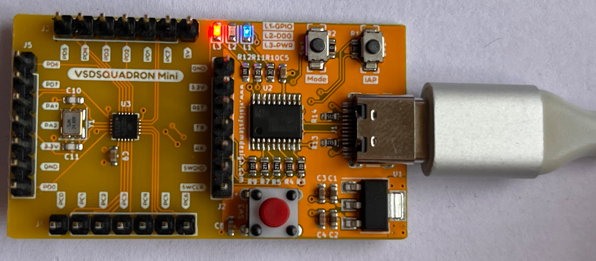
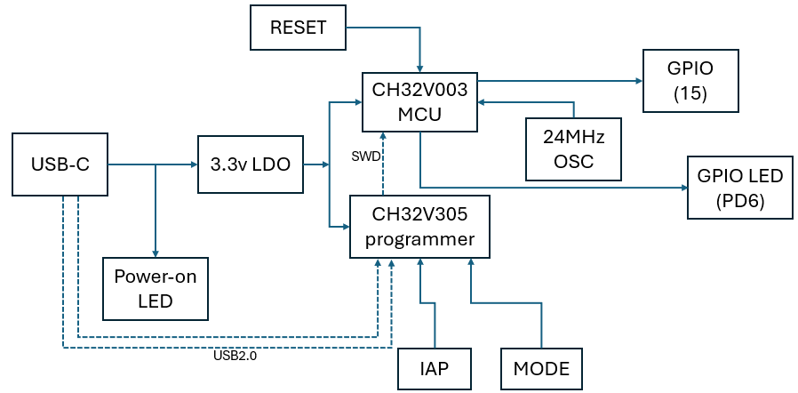

# Workshop Documentation Repository

This repository acts as the go-to resource for all critical materials related to workshop preparation and technical requirements.

---

## 📑 Table of Contents

### 1. Laboratory Setup Guide
- **File**: `StepsToSetupLabs.pdf`
- **Size**: 754.6 KB
- **Purpose**: Offers a detailed walkthrough for configuring laboratory settings for workshops.

### 2. Technical Specifications Document
- **File**: `datasheet.pdf`
- **Size**: 15.9 MB
- **Purpose**: Outlines technical specifications and provides reference materials for workshops.

---

## 🔧 How to Use

1. Start with `StepsToSetupLabs.pdf` to set up the laboratory environment.
2. Refer to `datasheet.pdf` for technical specifications and reference information.

### ⚠️ Important
- Adhere to the steps in sequence for an efficient setup process.
- Keep these documents accessible for future reference due to their critical content.

### 🔄 Update Information
- Last update: January 1, 2025

---

# VSDSquadron Mini RISC-V Development Board 🚀

<div align="center">

[](https://github.com/vsdip/vsdsquadron_mini)
[](https://github.com/vsdip/vsdsquadron_mini/wiki)
[](https://vsdsquadron.slack.com/)


  
  <br>
  <em>Your Gateway to RISC-V Development</em>

  [Quick Start](#quick-start) • [Documentation](#documentation) • [Features](#features) • [Support](#support)
</div>

---

## 🌟 Quick Start Guide

<details>
<summary>Expand for Details</summary>

### Prerequisites
- Visual Studio Code (VSCode)
- USB Type-C cable
- Minimum 100GB of free storage
- Compatible with Windows and Ubuntu operating systems

### Step 1: Connect the Board
<div align="center">
  
  <br>
  <em>Connect the USB Type-C cable as shown</em>
</div>

### Step 2: Install Required Tools
```bash
# 1. Download VSCode
https://code.visualstudio.com

# 2. Install PlatformIO Extension
# 3. Add the CH32V Platform
https://github.com/vsdip/vsdsquadron_pio
```

</details>

---

## 📋 Contents Overview

<details>
<summary>Click to Expand</summary>

- [Introduction](#overview)
- [Key Features](#features)
- [Detailed Specifications](#technical-specifications)
- [Setup Instructions](#getting-started)
  - [Prerequisites](#prerequisites)
  - [Installation Guide](#installation-guide)
- [Hardware Setup](#board-setup)
- [Programming Guide](#programming-guide)
- [Support Options](#support)

</details>

---

## 🎯 Introduction

<div align="center">
  
  <br>
  <em>Block Diagram of VSDSquadron Mini</em>
</div>

The VSDSquadron Mini is an advanced RISC-V development board tailored for educational use and technical research. It leverages the CH32V003F4U6 chip with a 32-bit RISC-V core compliant with the RV32EC instruction set.

<details>
<summary>Highlights</summary>

- Designed for RISC-V learning and development.
- Integrated programmer removes the need for additional hardware.
- Small size with USB Type-C compatibility.
- Includes 24MHz system clock, 16KB Flash memory, and 2KB SRAM.

</details>

---

## ⚡ Features

<details>
<summary>Core Components</summary>

- **Processor**: CH32V003F4U6 (32-bit RISC-V RV32EC)
- **System Clock**: 24MHz
- **Memory**:
  - 16KB CodeFlash
  - 2KB SRAM
  - 1920B Bootloader

</details>

<details>
<summary>Connectivity Options</summary>

- **GPIO**: 15 I/O ports divided into 3 groups
- **Communication Protocols**:
  - USART (PD6-RX, PD5-TX)
  - I2C (PC1-SDA, PC2-SCL)
  - SPI (PC5-SCK, PC1-NSS, PC6-MOSI, PC7-MISO)

</details>

---

## 🔧 Technical Specifications

<details>
<summary>Board Specifications</summary>

| Parameter             | Specification          |
|-----------------------|------------------------|
| Form Factor           | 50.00 x 28.00 mm      |
| I/O Voltage           | 3.3V                  |
| Input Voltage         | 5V (via USB)          |
| Current per I/O Pin   | 8mA (source/sink)     |
| Operating Temperature | 20-35°C (68-95°F)   |
| Max Component Height  | Top: 8mm, Bottom: 1mm |

</details>

<details>
<summary>Pin Configurations</summary>

### GPIO Assignments
| Interface | Pin Configuration                     |
|-----------|---------------------------------------|
| SPI       | PC5(SCK), PC1(NSS), PC6(MOSI), PC7(MISO) |
| I2C       | PC1(SDA), PC2(SCL)                   |
| USART     | PD6(RX), PD5(TX)                     |

### ADC Specifications
- **Resolution**: 10-bit
- **Channels**: PD0-PD7, PA1, PA2, PC4
- **Reference Voltage**: 3.3V

</details>

---

## 🖥️ Setting Up the Development Environment

### Virtual Machine (VM) Setup

<details>
<summary>Step-by-Step Guide</summary>

1. **Download and Install VirtualBox**
   - Obtain VirtualBox and the Extension Pack from the [official website](https://www.virtualbox.org/wiki/Downloads).

2. **Create a New Virtual Machine**
   ```plaintext
   Configuration:
   - Name: VSDSquadron
   - OS Type: Linux
   - Version: Ubuntu 18.04
   - Memory: 4096MB
   ```

3. **Attach the VDI File**
   ```plaintext
   - Select "Use an existing virtual hard disk file."
   - Browse and attach the downloaded VDI file.
   ```

4. **Optimize VM Settings**
   - Enable EFI and VT-x/AMD-V.
   - Allocate 128MB video memory.

</details>

<details>
<summary>Troubleshooting</summary>

- **Error: Virtualization not enabled**
  - Enable VT-x/AMD-V in the BIOS.
- **Performance Issues**
  - Increase allocated memory and enable 3D acceleration.

</details>

---

## 🚀 Programming Example

<details>
<summary>Sample Code</summary>

```cpp
#include "ch32v00x.h"

int main(void) {
    // LED pin configuration
    GPIO_InitTypeDef GPIO_InitStructure = {0};
    RCC_APB2PeriphClockCmd(RCC_APB2Periph_GPIOD, ENABLE);
    GPIO_InitStructure.GPIO_Pin = GPIO_Pin_6;
    GPIO_InitStructure.GPIO_Mode = GPIO_Mode_Out_PP;
    GPIO_InitStructure.GPIO_Speed = GPIO_Speed_50MHz;
    GPIO_Init(GPIOD, &GPIO_InitStructure);

    while(1) {
        GPIO_WriteBit(GPIOD, GPIO_Pin_6, Bit_SET);   // LED ON
        Delay_Ms(1000);
        GPIO_WriteBit(GPIOD, GPIO_Pin_6, Bit_RESET); // LED OFF
        Delay_Ms(1000);
    }
}
```

</details>

---

## 🤝 Support Options

- **Email**: vsd@vlsisystemdesign.com
- **Slack**: [VSDSquadron Community](https://vsdsquadron.slack.com/)
- **Documentation**: [CH32V003F4U6 Datasheet](link-to-datasheet)

---
## workshop task
<div align="center">
  

## 📝 License

© 2024 VLSI System Design (VSD)

